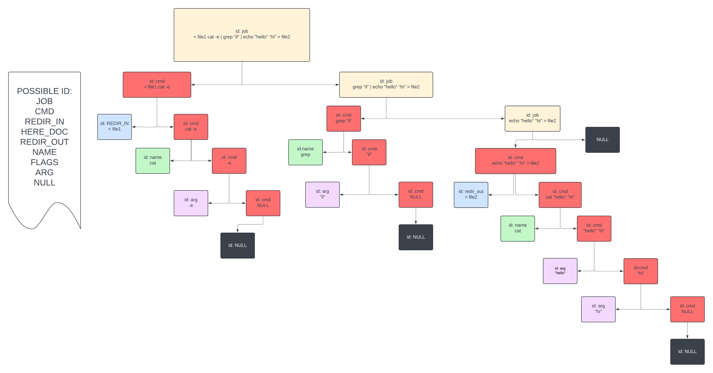

# Minishell

Minishell is a simplified version of a Unix shell written in C. It replicates core functionalities of bash, allowing interaction with a command-line interface. This project focuses on learning about processes, file descriptors, and signal handling.



Parsing tree algorithm

---

## **Features**

- **Prompt Display**: Shows a prompt while waiting for user input.
- **Command Execution**: Supports commands via absolute, relative paths, or the `PATH` variable.
- **Built-ins**: Implements essential shell commands:
  - `echo` with `-n` option.
  - `cd` with relative or absolute paths.
  - `pwd` to print the working directory.
  - `export` to set environment variables.
  - `unset` to unset environment variables.
  - `env` to display environment variables.
  - `exit` to terminate the shell.
- **Redirections**:
  - Input (`<`) and output (`>`).
  - Append mode (`>>`).
  - Heredoc (`<<`) with a delimiter.
- **Pipelines**: Connect commands using the `|` operator.
- **Environment Variable Expansion**: Expands variables prefixed by `$`.
- **Special Variables**:
  - `$?`: Represents the exit status of the last foreground command.
- **Signal Handling**:
  - `Ctrl-C`: Interrupts and redisplays the prompt.
  - `Ctrl-D`: Exits the shell.
  - `Ctrl-\`: Does nothing in interactive mode.
- **Quote Handling**:
  - Single quotes (`'`): Ignore meta-character interpretation.
  - Double quotes (`"`): Allow `$` expansion but ignore other meta-characters.

---

## **How to Compile**

Use the included `Makefile` to build the program:

```bash
make
```

---

### **Running the Program**
Run the minishell by executing:
```bash
./minishell
```
Now the program starts and you are inside of our shell

---

**Example Comands**

```bash
echo "Hello, Minishell!"
export MY_VAR=test
echo $MY_VAR
cd /path/to/directory
echo $SHLVL "$SHLVL" '$SHLVL' "$SH''LVL"
echo "smth"'$PATH'
ls | wc | echo > out.txt | wc -l
echo "> >> < * ? [ ] | ; [ ] || && ( ) & # $ <<"
unset PATH
ls
```
---

### **Project Requirements**
**Mandatory**:
- Must support the described features.
- Should not use more than one global variable (only for signal handling).
- Follow bash behavior as closely as possible.

---

## **Error Handling**
Minishell gracefully handles:
- Invalid argument formats.
- Invalid commands or file paths..
- Memory leaks (except for readline's known issues).
- And a every other little detail of shell that we putted effort to handle

---

## **Authors**
- Sergey: [sephilip0](https://github.com/sephilip0)
- Dinis: [DinisPetrukha](https://github.com/DinisPetrukha)

